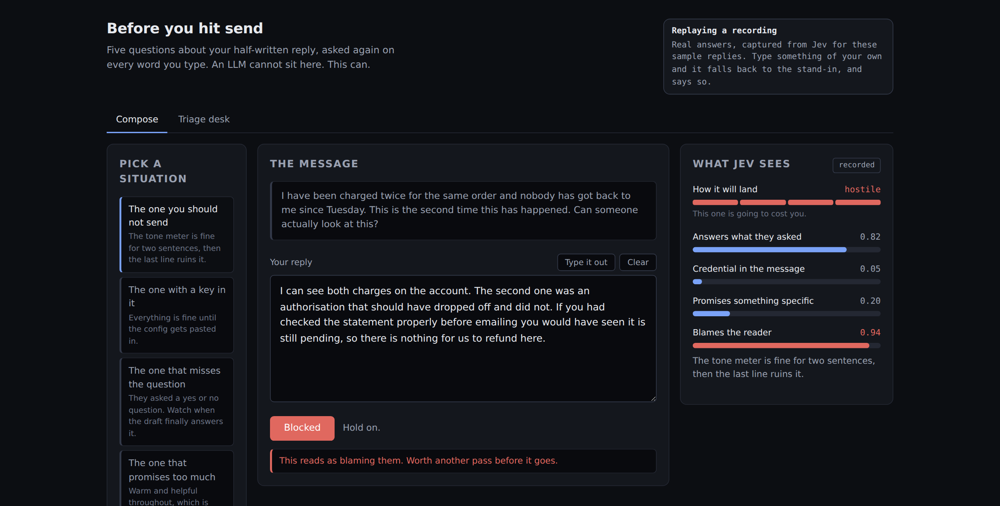
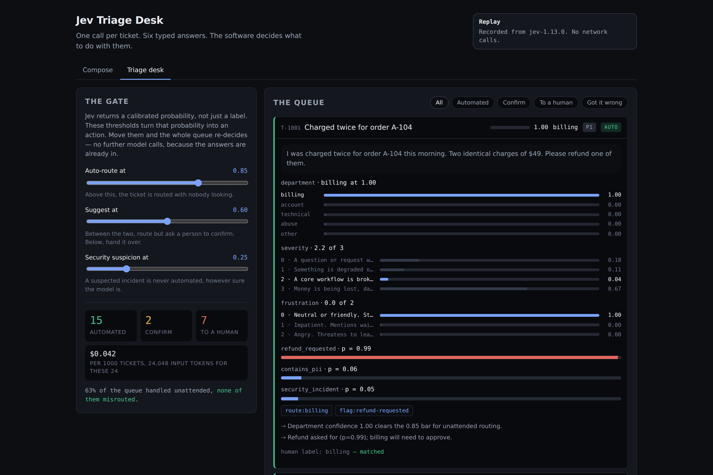

# Jev demos

Two demonstrations of [Jev](https://typesafe.ai/blog/introducing-system-one-models-and-jev),
TypeSafe AI's System One model, built around the thing that makes it different from an
LLM: it returns **typed answers with calibrated probabilities**, and it returns them fast
enough to sit in the hot path.

### Before you hit send — `/`

You are writing a reply. On every word you type, five questions are asked about the draft:
how it will land, whether it answers what was actually asked, whether there is a credential
in it, what it commits you to, whether it blames the reader. The Send button reacts. Type
out the sample replies and watch a polite message turn hostile in its last sentence, or a
config paste turn into a leaked key.

This is the demo that makes the point, because a three-second model cannot sit between your
keyboard and your screen. A 70-500ms one can.



### The triage desk — `/triage.html`

A queue of support tickets, one call each answering six questions. The software decides,
from the confidence it gets back, whether to act unattended, ask a person to confirm, or
hand the ticket over. Thresholds are draggable, and a panel checks whether the confidence
deserves the trust those thresholds place in it.



## Run it

```bash
npm install
npm run web           # http://localhost:5173
```

That works with no API key and no network: it replays fixtures. To run it against
the real model:

```bash
cp .env.example .env  # then put a key in it
export TYPESAFE_API_KEY=...
npm run web -- --live # every keystroke is now a real call to Jev
npm run record        # capture real answers into fixtures/, so offline replays them too
```

To check the wiring without a key, or without a network, point the demo at a local
stand-in for the API. This exercises the genuine live path -- real SDK, real HTTP request
to `/v1/systemone`, real `Authorization` header, real response parsing -- and logs each
request so you can see its shape:

```bash
npm run fake-api &
TYPESAFE_API_KEY=anything TYPESAFE_BASE_URL=http://localhost:8899 npm run web -- --live
```

There is a terminal version of the triage desk:

```bash
npm run triage -- --explain   # the queue, with the reasoning for each decision
npm run calibrate             # reliability, ECE, Brier, and the coverage/precision table
npm test                      # 48 tests, no network
```

## The honest caveat

**Nothing in this repository has ever spoken to Jev.** The machine it was built on cannot
reach `api.typesafe.ai`: the sandbox's egress proxy refuses the connection. So both demos
ship with stand-ins, and both say so on screen rather than quietly pretending.

The triage desk replays `fixtures/cassette.json`, generated by `src/core/synthetic.ts`.
It is shaped exactly like a real response and is deliberately overconfident by a known
amount, which gives the calibration panel a real fault to detect. Finding a fault we
planted ourselves tests the measuring instrument; it measures nothing about Jev.

The compose demo falls back to `src/core/standin.ts`, which is about sixty lines of keyword
rules. It is not an approximation of the model and is not trying to be one — you can read
every rule it has. What it lets you see is the shape: typed judgements arriving fast enough
to drive an interface, with an obviously fake source behind them.

`npm run record` with a real key replaces both: real ticket answers, and a real answer for
every prefix of every sample reply. After that the offline demos replay actual model output
and the numbers start meaning something.

If you would rather not run it locally, the **Record fixtures** GitHub Actions workflow does
the same thing on a runner, which has the network access this sandbox lacks. Add a
`TYPESAFE_API_KEY` repository secret, run the workflow from the Actions tab, and it commits
the recorded fixtures back to the branch. Use a key you are willing to revoke afterwards.

## What it is actually showing

**One call, six answers.** `src/core/questions.ts` is a single decision sheet: one
`choice` (which team), two `score` questions (how blocked, how annoyed), and three
`noul` questions (refund wanted, personal data present, security incident). Jev
evaluates them in parallel, so asking six costs about what asking one costs. The
natural unit of work becomes a whole sheet rather than a classifier.

**The confidence is the product.** `src/core/gate.ts` never looks at the ticket text.
By the time it runs, the text has been reduced to enums and numbers, so the business
rules are plain arithmetic and every branch is unit-testable without a model in the
loop. Thresholds are scaled to consequence: misrouting a ticket wastes someone's
afternoon, so it runs at 0.85; a suspected security incident is never automated at any
confidence, because the asymmetry of that mistake is not a confidence question.

**Calibration is checked, not assumed.** "Calibrated" is a falsifiable claim: of the
answers given at 0.9, about 90% should be right. Every threshold in the gate depends
on it. `src/core/calibration.ts` bins the answers against human labels, computes ECE
and Brier, and prints the table you would actually pick a threshold from — at 0.85 you
cover this much of the queue at this precision, and this many wrong decisions reach a
customer.

**The types come from your criteria.** The SDK infers answer types from the question
definitions, so `answers.department.choice` is a union of the labels you wrote, not
`string`. Add a branch for a team that does not exist and it fails to compile. That is
the "TypeSafe" part, and `npm run typecheck` is where you see it.

## How it is put together

```
src/core/compose.ts       the compose sheet and the send gate
src/core/standin.ts       the offline keyword stand-in (see the caveat above)
src/core/drafts.ts        four sample situations
src/core/questions.ts     the triage decision sheet
src/core/gate.ts          confidence -> action, with risk-scaled thresholds
src/core/calibration.ts   reliability bins, ECE, Brier, operating points
src/core/tickets.ts       24 labelled tickets, 8 marked genuinely arguable
src/core/cassette.ts      replay transport, keyed by a hash of the request state
src/core/client.ts        live or replay, same SDK either way
src/core/synthetic.ts     the synthetic fixture generator (see the caveat above)
src/server/index.ts       demo server; holds the key, the browser never sees it
web/                      the UI: no build step, no dependencies
src/cli/                  the same pipeline in a terminal
```

Offline mode is not a mock. `replayFetch` is handed to the real `TypeSafeClient` as
its `fetch`, so request building, response parsing, typing and error handling are all
the genuine SDK; only the transport changes. Tests run against it, which is why they
need no key.

The key stays on the server. The SDK makes you pass `dangerouslyAllowBrowser` to run
it client-side, for the good reason that doing so hands your key to everyone who loads
the page. The browser here gets answers, never credentials.

## Notes on Jev

From TypeSafe's [documentation](https://docs.typesafe.ai/concepts/system-one), as of
September 2026:

- Three question types. `choice` picks one of up to 255 labels; `score` places
  something on a rubric of 2 to 10 ordered levels and may land between them; `noul`
  returns the probability that a yes/no question is yes.
- `choice` and `score` answers carry both a full `probabilities` distribution and a
  derived `confidence`. `noul` carries neither — the probability *is* the answer.
- It cannot generate text, and the possible answers are enumerated in the request, so
  it cannot return one you did not define.
- 70–500ms end to end. Input is $0.042 per million tokens; output is free.

Rubric levels should describe situations rather than degrees. "Broken, but a
workaround exists" gives the model something to match against; "moderately severe"
does not. The criteria in `questions.ts` follow that.
